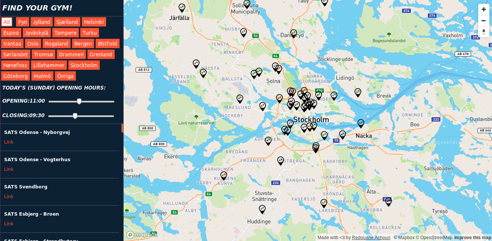

# my-gym-locator
[Work in Progress] Web application to locate SATS gym centers on a map and see the available facilities

### Brief Description
The purpose is to make it easy to check whether your favorite SATS gym center is open, and also to check the available facilities, all of which in English and easy to access in one single map.

The application deployed at [this link](https://my-gym-locator.herokuapp.com/)

The original SATS website are:
- [Sweden](https://www.sats.se/)
- [Norway](https://www.sats.no/)
- [Denmark](https://www.sats.com/)
- [Finland](https://www.elixia.fi/) (Named Elixia)

_N.B.:_ The map is provided externally, but if you want to have a self-hosted map then I have a script to deploy an OpenStreetMap server [here](https://github.com/redouane-dev/my-scripts/blob/master/install-openstreetmap-tile-server.sh).


### Specifications
This project uses [Mapbox](https://www.mapbox.com/) and is deployed via [Docker](https://www.docker.com/) on [Heroku](https://www.heroku.com) as a web application.


### Running the server

You can run the server with either [GUncorn](https://gunicorn.org/) or via Docker.


#### GUncorn

```bash
# Create a virtual environment (to avoid conflicts between dependencies in your Python projects)
virtualenv -p python3 venv

# Activate the newly created virtual environment
source venv/bin/activate

# Install the requirements
pip install -r requirements.txt

# Run the server
gunicorn --bind 0.0.0.0:8080 app:app # [you can use localhost instead], [--reload for debug and dev mode only]
```

#### Containerized Application

N.B.: We don't need a virtual environment for development in this case, as the application is dockerized.

```bash
# Build a new docker image and a new container base on it
docker build --file Dockerfile-local --tag <image-name> . # [--file <dockerfile-name> to specify non-default Dockerfile]

# Check that the image with name <image-name> has been successfully created
docker images

# We're going to set the external port to 8080 but any free port can work. The internal port is designed to be 5000.
docker run --detach -p 8080:8080 <image-name>
```

### Open the Application

After spinning the server, you can open your browser at http://localhost:8080/ to see a map




## Perspectives

- Validate deployment on Heroku
- Parse JSON/XML files from the gym's website
- Display markers on the map
- Add popups and information on the markers
- Automate the process of fetching/parsing/displaying as a CRON job or others.
- ...
